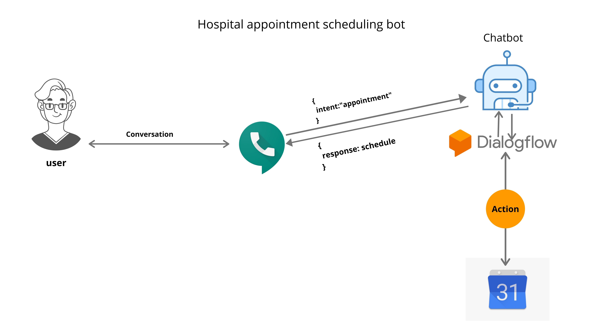

# Google calendar interactive chatbot

<a href="https://cloud.google.com/dialogflow/docs">Dialogflow</a> is a natural language understanding platform for human-computer interaction technologies based on natural language conversations.

Dialogflow abstracts Natural Language Processing, Machine Learning, and other more profound concepts that give a clean and focus conversation flow. 

The technology used in this project: 
- Javascript, 
- Google's DialogFlow 
- Google calendar API
- Google voice for free telephone number (210) XXX XXXX
